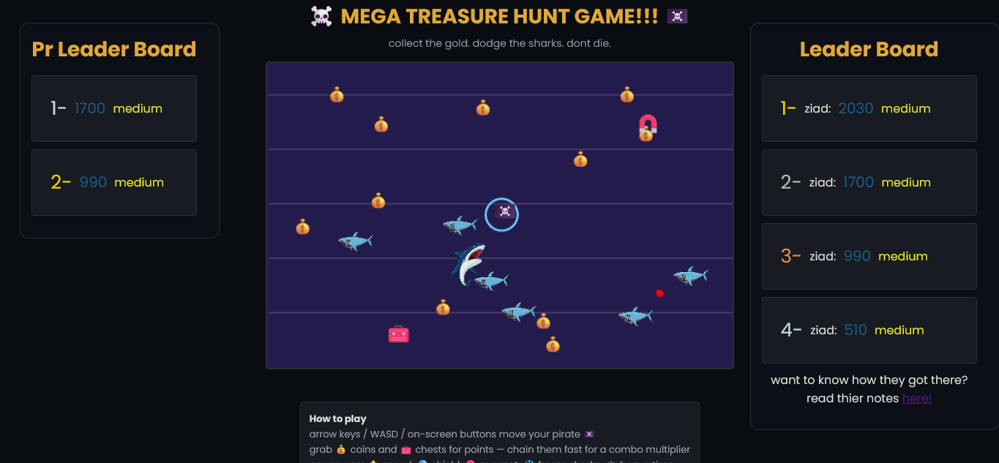

# Mega-Treasure-Hunt

Mega Treasure Hunt is a small pirate game where you collect as much treasure as possible while trying not to get caught by sharks.

The goal is pretty simple: collect the gold, open the chests, build up your combo, and survive for as many levels as you can.

## Tech stack

this game is a full stack project

the front end is made using pure html,css,js

and the backend is made using python fastapi

## Play the game

you can try the game from here right away

https://zezo386.github.io/Mega-Treasure-Hunt/

# Front end

## Main Page

## Features

### How to play

in the game you will find a how to play guide at the bottom that explains the controls

- Use **WASD** or the **arrow keys** to move.
- Collect coins and treasure chests to get points.
- Try to collect treasure quickly to build your combo.
- Avoid the sharks because they cost you a life.
- Bigger boss sharks appear every 3rd level.
- Collect everything on the screen to move on to the next level.
- Press **SPACE** to pause the game.

### Difficulties

There are 3 difficulties:

- Easy
- Medium
- Hard

Each one makes the game a bit different

each one also changes

- 1- how much points you get from each coin (the harder the more coins you get)
- 2- how fast you can move (the harder the slower you move)
- 3-how many sharks get added each level (the harder the more sharks will get added)
- 4- how fast the sharks are (the harder the faster the sharks move)
- 5- the charge time for the boss shark attack (the harder the lower this timer is)

### Power-ups

There are different power-ups that can help during the game:

- Speed boost -> makes you faster which can make you do very fast maneuvers
- Shield -> protects you from sharks for a small period
- Magnet -> attracts coins to you so you can get better combos and finish the levels faster
- Freeze -> freezes the sharks in their places
- Bonus time -> adds more time

### Combos

this game includes a combo mechanic where the more coins you collect in a short period of time, you get bonus points for each new coin

the combo multiplier is visible in the hud and next to it is a progress bar that tracks when the combo will run out

to refill the combo bar you have to collect a new coin

### Boss Sharks

in the game there are 2 types of sharks

- normal sharks -> these are normal sharks that are wide but not really tall and move at a normal speed and deal 1 damage
- **Boss Sharks** -> these are sharks that are tall and move at 75% speed of the normal sharks and deals double the damage, they also have a charge attack where they stay still for some time then come really fast at you

### Coins and Chests

coins and chests are the main way to gain points

coins give points according to the difficulty, and the chests give 5x the coins

### LeaderBoards

in the game there are 2 leaderboards

the first one is the global leaderboard that is connected to the backend and it contains the top players and thier scores and shows the top 10 scores ever in the game

the second leaderboard is for personal records which shows you your best 5 scores

### Floaters

when collecting coins and chests floaters will appear to show you how many points you got from it

### Sounds

all sounds in this game is made using js with tones

### Lives mechanic

each game you have 3 lives

each time a shark hits you, you lose a live

each time a boss shark hits you, you lose 2 lives since it deals double the damage

## Notes page

notes.html is the notes page where people can leave notes to each other to help each other out to get a better score

you can also share your opinions about the game and what should be added or changed there

# Backend

the backend is made entirely using python fastapi and deployed on railway

and the database is in a file named database.db and controlled using sqlite3

## Endpoints

### top10

https://mega-treasure-hunt-backend-deployment-production.up.railway.app/top10/

this endpoint gets you the top10 on the leaderboard

this endpoint is a get request endpoint and does not take any parameters

### top5pr

https://mega-treasure-hunt-backend-deployment-production.up.railway.app/top5pr/{username}

this endpoint gets you the top 5 personal records for the personal records leaderboard

this is also a get request endpoint and only takes the user name (replace {username} with the username you are trying to get the prs for)

https://mega-treasure-hunt-backend-deployment-production.up.railway.app/top5pr/ziad

this is an example that gets my top 5 personal records

### add_score

https://mega-treasure-hunt-backend-deployment-production.up.railway.app/add_score/

this is an endpoint that adds a new score to the database and determine its place on the leaderboard and the personal records

this is a Post request endpoint that take these parameters

- username -> the name that will be stored in the database
- score -> the score the user has achieved
- difficulty -> will be stored to show which difficulty the player achieved the score in

### notes

https://mega-treasure-hunt-backend-deployment-production.up.railway.app/notes/

this is an endpoint that gets the notes from the players who post in the notes page

this is a get request endpoint that takes 3 optional parameters that filter them accordingly

- username -> a string taken in the get request that filters the notes by the username that noted it
- start-date -> a string in the iso-8601 format (YYYY/MM/DD) that filters them by adding a lower limit to the notes from the start date
- end-date -> a string in the iso-8601 format (YYYY/MM/DD) that filters them by adding an upper limit to the notes up to the end date

this is an example of filtering by the username

https://mega-treasure-hunt-backend-deployment-production.up.railway.app/notes/?username=ziad

while this is an example of filtering by a start date

https://mega-treasure-hunt-backend-deployment-production.up.railway.app/notes/?start_date=2026%2F09%2F28

and this is an example of filtering by an end date

https://mega-treasure-hunt-backend-deployment-production.up.railway.app/notes/?end_date=2026%2F09%2F27

### add_note

https://mega-treasure-hunt-backend-deployment-production.up.railway.app/add_note/

this is an endpoint to add notes to the database

this is a post request endpoint that takes 2 parameters

- username -> the name that will be displayed on the note in the front end
- note -> the note text that the user wants to share with others

the date of the message is automatically determined in the backend

## How to clone

just use this simple command

`git clone https://github.com/zezo386/Mega-Treasure-Hunt`

## About the project

I made this as a browser game project and focused on making it more than just a basic collect-and-avoid game. I added things like combos, power-ups, different difficulties, levels, stats, and boss sharks to give the game more to do.

Have fun and try to beat the high score.

## Contributions

this game backend is made enitrely from the GOAT of programming

Ziad elhusiny

Saikernel also did the foundation of the project and without him i would not have made it

### some funny parts

i finished this game while having a nose bleed and being 3 hours away from the deadline and being out of town

so we hope the reviewers accept this project since we worked so hard to make it
